[linkedin](https://www.linkedin.com/in/aaronmurphy45/) &nbsp;·&nbsp;
[email](mailto:aaronm2766@gmail.com)

> Backend engineer in Dublin, Ireland. 
> Systems that have to stay up, and the pager that proves it.

Five years building things other people depend on. Mostly Python, some Go, a lot of 
SQL, and more YAML than I'd like to admit to in public.

I like the unglamorous half of the job: finding the N+1, deleting more than I add, 
making the slow thing fast, and writing the runbook so nobody has to guess at 3am.

<samp>python &nbsp; go &nbsp; sql &nbsp; javascript &nbsp; airflow &nbsp; celery &nbsp; redis &nbsp; postgres &nbsp; azure &nbsp; docker &nbsp; git &nbsp; linux</samp>

<!-- The projects section is parked until there are real public repos to point
     at. Restore it from git history rather than rewriting the placeholders:
     the heading art (hd-projects.svg) is still in the repo and unused. -->

No badge services here. Every image on this page is an SVG built in this repo 
and committed alongside the README, which means there is no third-party host to 
rate-limit me, change its API, or quietly shut down.

[A nightly action](.github/workflows/stats.yml) queries the GitHub GraphQL API, 
redraws the stat graphics, and commits only the files whose bytes actually 
changed — a quiet day produces no commit at all.

The headings are images because styling README text is impossible — GitHub 
sanitises `<script>` and `<style>` out of markdown — so the only route to a 
chosen typeface is to draw the words yourself.

That typeface is [JetBrains Mono](scripts/fonts), subset per graphic to the 
handful of glyphs it draws and base64-inlined, since an SVG loaded via `` 
cannot fetch anything external.

Every graphic is drawn complete at frame zero. That constraint is the whole 
design, and it was learned the hard way: GitHub renders a README image at t=0 
and never advances the SMIL timeline, so a fade that starts at opacity 0 or a 
clip that reveals from width 0 is not a subtle animation — it is a blank box, 
permanently, for every visitor. The first version of this page shipped a 
terminal that typed itself out and was therefore invisible. Motion now only 
ever loops on top of an already-finished picture.

Language figures count public repositories only. `year.svg` draws one character 
per day: `:` `+` `#` `@`, quiet to loud.
